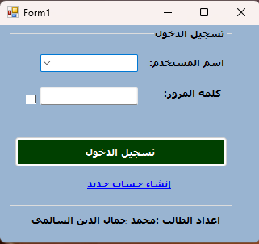
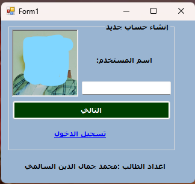
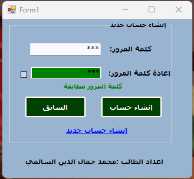
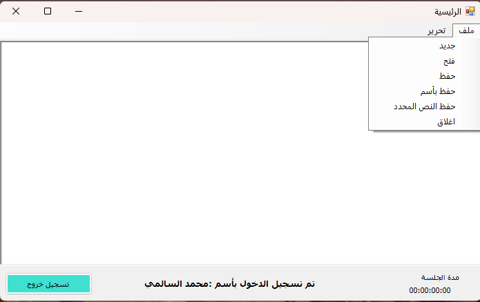
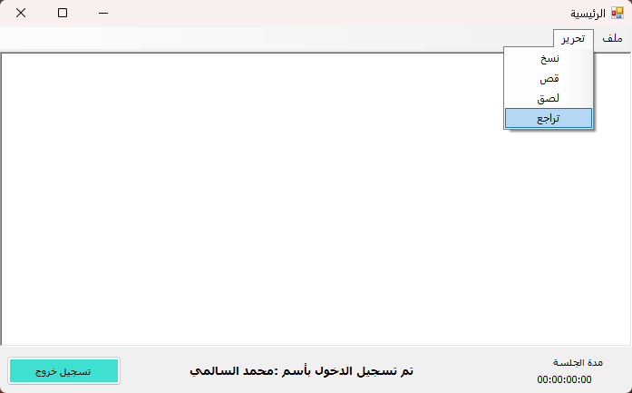

# ACCUNTE End NotBad

برنامج مكتبي بلغة #C لإدارة الحسابات وتسجيل الدخول مع مفكرة مدمجة.

---

## 💡 وصف المشروع

مشروع بسيط يتضمن:

- 🔐 تسجيل الدخول للمستخدمين
- 📝 إنشاء حسابات جديدة
- 🗒️ مفكرة لتدوين الملاحظات الشخصية

---

## 🚀 كيفية التشغيل

1. افتح المشروع باستخدام **Visual Studio**.
2. اضغط على **Start** أو **F5** لتشغيل البرنامج.
3. جرّب تسجيل الدخول أو إنشاء حساب، ثم استخدم المفكرة لتدوين ملاحظاتك.

---

## 🖼️ صور من الواجهات

### 🔐 تسجيل الدخول

### 📝 إنشاء حساب

### 📝 إنشاء حساب

### 🗒️ المفكرة

### 🗒️ المفكرة

---

## 📁 هيكل المشروع

